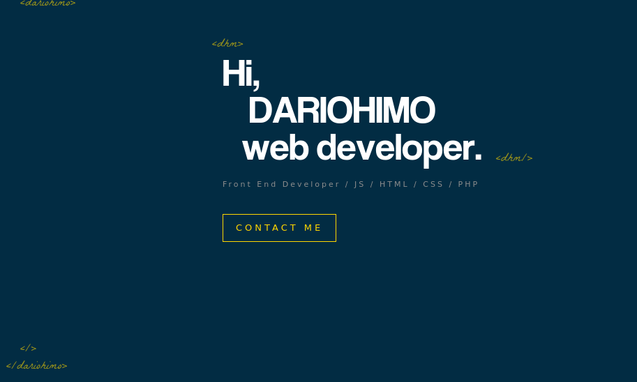
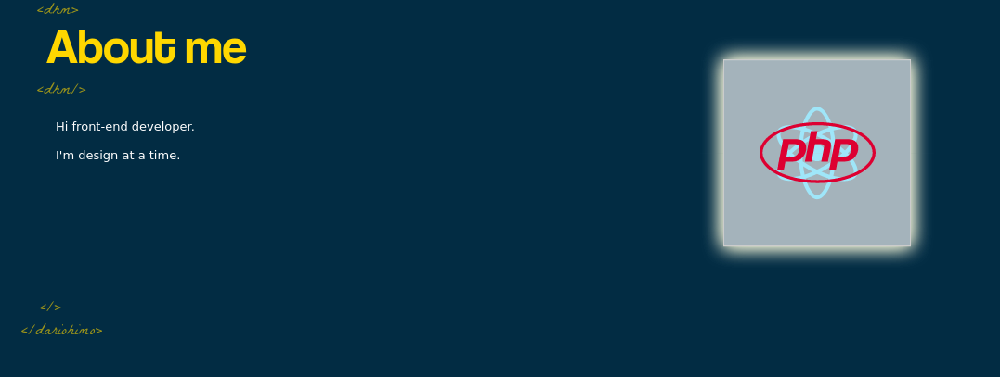
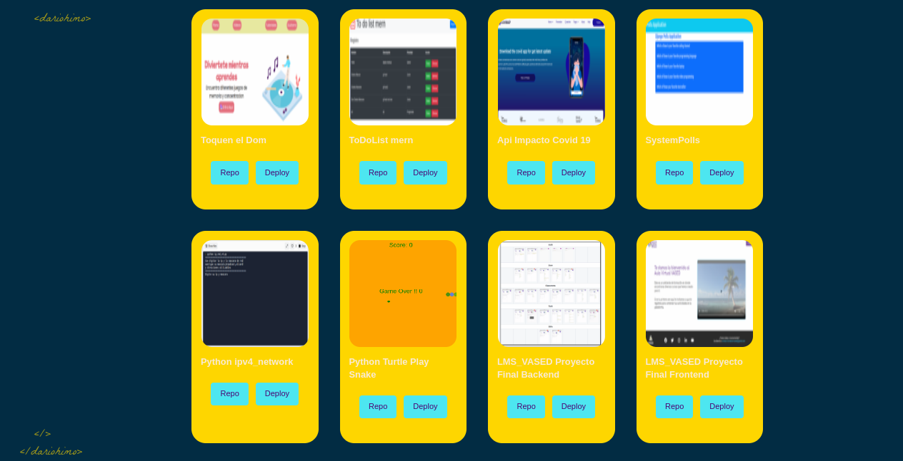
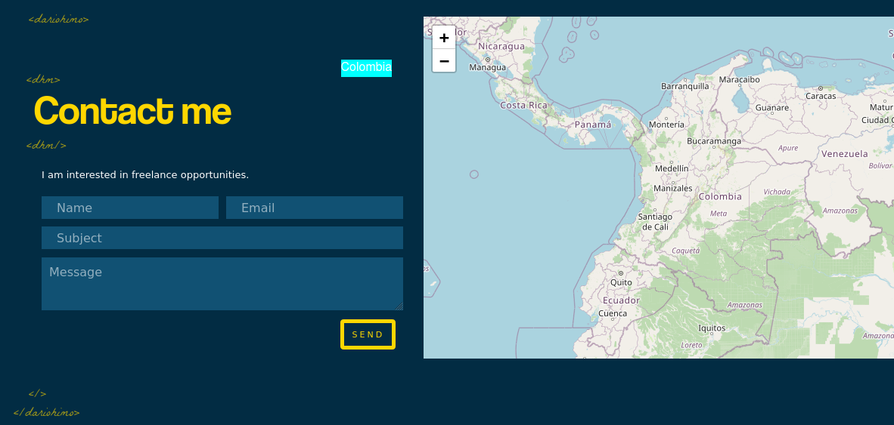

## Nuestra mejor carta de presentación ONLINE

<details>

https://bedecked-temple-4d4.notion.site/Links-de-Inspiraci-n-aef59e8285c24c4eba171b2290b74e58

https://dribbble.com/tags/react_portfolio

https://reactjsexample.com/22-best-react-portfolio-page-templates-in-2021/

https://www.canva.com/es_es/curriculums/plantillas/?utm_source=google_sem&utm_medium=cpc&utm_campaign=es_es_all_pro_rev_conversion_branded-tier2_em&utm_term=es_es_all_pro_rev_conversion_Branded_Tier2_Resume_Builder_EM&gclid=CjwKCAjwlcaRBhBYEiwAK341jf4LnJBoi4CcPnEd127t7-7Xowd-DSw9OoJvf7HKSWFD-HE0YrI_NBoCmUAQAvD_BwE&gclsrc=aw.ds

https://threejs.org/

https://www.figma.com/file/VKke2Lijp9ea6pObO4jjVz/Wireframes-Portafolio?node-id=0%3A1


Crearemos nuestro portafolio online haciendo uso de HTML, CSS , JAVASCRIPT y REACT recuerda que debe cumplir con la estructura descrita en los recursos.  Haremos uso de lo trabajado en diseño de la marca personal.

Contexto del proyecto
¿Qué es un Portafolio Online?

​

** **Un portafolio online es la mejor manera de mostrar tu trabajo y permite que otras personas sepan más de ti. Además de esto, es una de las mejores formas para expresar tu personalidad, experiencia y capacidades.

​

**¿Cuál es el propósito de tener un portafolio online? **

Sólo toma unos segundos el perder la atención de un visitante, así que asegúrate de utilizar estos segundos sabiamente. Tus clientes potenciales y/o la empresa que está buscando contratarte verán primero el diseño y si les gusta lo que ven, ellos seguirán buscando para encontrar más detalles. En otras palabras, necesitas una sorprendente y atractiva presentación de tus trabajos.

Esto se puede hacer de muchas maneras – diapositivas, presentaciones en video, galerías con vistas previas, etc. Por ejemplo, si eres un programador puedes crear tu sitio web mostrando los proyectos que desarrollaste asegurandote que el usuario visualmente quiera entrar y ver lo creado, para lo cual puedes usar imagenes claras, tecnologías usadas y links de las soluciones (si aplica). Adicional, será importante contar un poco de ti y de la experiencia que tienes como desarrollador,de manera transversal tus canales de contacto, puede ser un formulario, botones de mensajería instantanea, tus perfiles profesionales como linkedIn, github y correos profesionales, por último será como plus tener testimonios de clientes o equipos de desarrollo con los que hayas trabajado, así mismo como tener un blog y/o algo que crean conveniente que sume a cumplir el objetivo del portafolio.

Esta será la primera versión del portafolio, durante todo el bootcamp actualizaremos e iremos incluyendo mejoras al mismo para que al final tengamos una presentación online que podamos usarla para nuestra vida profesional.

​

Requerimientos técnicos ⚙️

El proyecto DEBE utilizar la metodología Scrum.
La página DEBE ser responsive
El proyecto DEBE ser desarrollado con React
El proyecto DEBE incluir el curriculum
El repositorio DEBE tener un Readme muy específico, con capturas de pantalla y los pasos para la instalación de las librerías si las van a usar.
​

Recomendaciones.

Pueden utilizar bootstrap.
Pueden utilizar Tailwind.
Pueden utilizar preprocesadores de CSS.
Pueden usar librerías de React que aporten a la elaboración de su proyecto
Modalidades pedagógicas
Definición de sprints

Sprint 1: Planning de proyecto 22 de marzo

Sprint 2: Mockups en sus 2 versiones 28 de marzo

Sprint 3: review de código (avances) 5 de abril

Entrega final 7 de abril hasta 11:59pm

Demo 8 abril

​

Deben realizar las entregas en las fechas estipuladas, recuerden agregar el link y una descripción de lo que están entregando.

Asegurarse de entregar links funcionales y con accesos para que podamos revisar.

Criterios de rendimiento
El sitio desarrollado debe cumplir con:

Estructura de carpetas y archivos
Código comentado en inglés
Los commits realizados a su repo de Github deben estar en inglés
Que cumpla con la estructura mínima de los wireframes presentados en los recursos
Que cumpla con el look & feel de lo propuesto en el mockup inicial
Que cumpla con lo planeado desde el punto de vista de la marca personal
Entrega completa: lo descrito en Entregables esperados

Modalidades de evaluación
Evaluación por pares (coevaluación)

Entregables
- Planning propuesto para el desarrollo del proyecto
- Link al  mockup diseñado en figma del portafolio en sus 2 versiones Desktop y Mobile
- Link del repositorio de github donde esté todo el código fuente y media del sitio desarrollado
- Link del despliegue del portafolio en internet
NOTA: Todos los entregables se deben subir en las fechas dispuestas a continuación en SIMPLONLINE

</details>

---
---
<summary>Home </summary>



___
---

<summary>About </summary>



---
___
<summary>Porfolio </summary>



---
___
<summary>Contact</summary>



---
---
#### Tecnologías: 

- react
- scss
- npm
<p align="center">
  <a href="https://skillicons.dev">
    
  </a>
</p>

```
npm install 
npm start 
```


##

 <summary style="color:green" > links proyect </summary>

#

[Repository GitHub](https://github.com/dariohimo/Portfolio "Portfolio")

#

[Portfolio en replit](https://portfolio.dariohimo.repl.co/ "Portfolio")

#

---
@dariohimo Abril 8 de 2022
___


